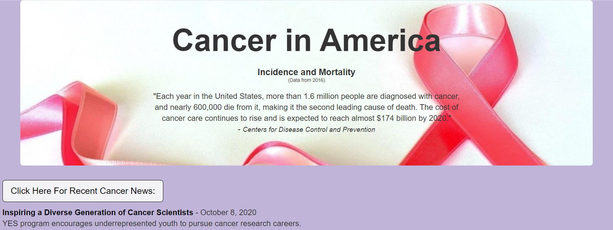
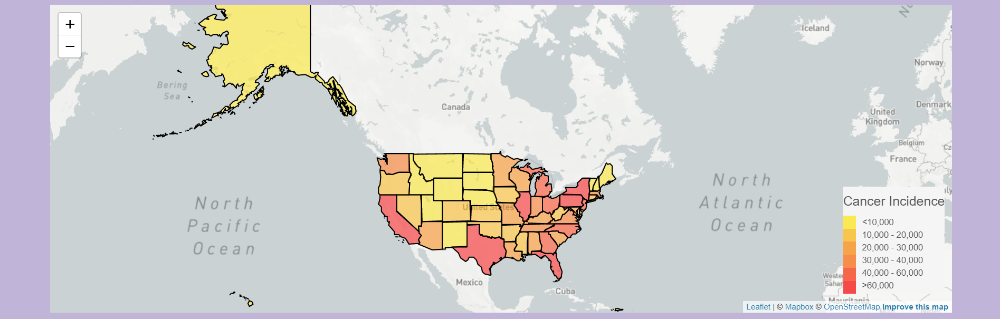
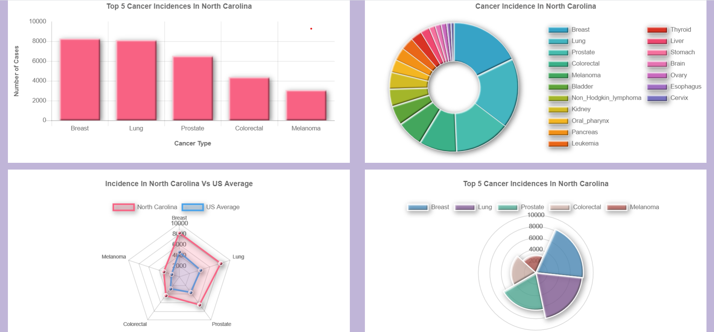
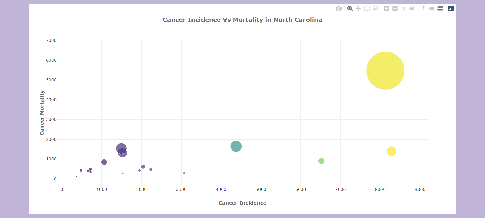

# Cancer Incidence And Mortality In America

Thanks for checking out our team's repo! Our team retrieved data from multiple sources to observe cancer incidence and mortality across the United States in 2016. By downloading our repo and running app.py through flask, you can view an interactive US map with a dashboard of several visualizations below. (Note: You will need your own API key from [MapBox](https://www.mapbox.com/) to successfully generate the US map.) By clicking a new state on the map, the interactive dashboard updates with that state's cancer incidence and mortality data. In addition, you can click the button at the top of the page to web scrape a current news article to learn more about research being conducted in the fight against cancer.  

### Screenshots Of Our Final Product:

<b>Heading And Web Scraping Portion:</b> 
  

<b>Interactive US Map:</b> 
 

<b>Interactive Chart.js Graphs:</b> 
 

<b>Interactive Plotly Bubble Chart:</b> 
 

<!-- TABLE OF CONTENTS -->
## Table Of Contents

* [About The Project](#about-the-project)
  * [Built With](#built-with)
* [Sources](#sources)
* [Project Instructions](#project-instructions)
* [Team Members](#team-members)

<!--About the Project-->
## About The Project
 Our team retrieved data from multiple sources to observe cancer incidence and mortality across the United States in 2016. Datasets were transformed to GeoJSON and JSON files using Pandas dataframes. A RESTful API with Python and Flask was used to load data into MongoDB. JavaScript, D3.js, Geomapping with Leaflet.js, and Chart.js were utilized to generate an interactive United States map with a dashboard on top cancer incidence and mortality per state. Flask was used to web scrape a current cancer news article from cancer.gov, send scraped information to MongoDB, and render it on our html page.

<!--Built With-->
### Built With
This project was built using the following frameworks/libraries/databases: 
* Python 
* Pandas
* Flask
    * Dependencies for Flask: bson, flask_pymongo, flask_cors
* GeoJSON
* JSON
* Requests
* MongoDB
* JavaScript
* Geomapping with Leaflet.js
* Chart.js

<!--Sources-->
## Sources
* https://statecancerprofiles.cancer.gov/
* https://www.cancer.gov/research/resources/resource/130
* https://www.cancer.gov/news-events
* https://www.cdc.gov/cancer/uscs/dataviz/download_data.htm
* https://wonder.cdc.gov/
* https://eric.clst.org/tech/usgeojson/

<!--Project Instructions-->
## Project Instructions

### Description
1. Your task is to tell a story through data visualizations.
2. Focus on providing users an interactive means to explore data themselves.
3. Prepare a 10-minute presentation that lays out your theme, coding approach, data munging techniques, and final visualization.
4. You may choose a project of any theme, but we encourage you to think broadly.
5. You will have ample time in class to work with your group, but expect to put in hours outside of class as well. 

### Requirements
1. Your visualization must include a Python Flask–powered RESTful API, HTML/CSS,
JavaScript, and at least one database (SQL, MongoDB, SQLite, etc.).
2. Your project should fall into one of the below four tracks:
* A custom “creative” D3.js project (i.e., a nonstandard graph or chart)
* A combination of web scraping and Leaflet or Plotly
* A dashboard page with multiple charts that update from the same data
* A “thick” server that performs multiple manipulations on data in a database prior to visualization (must be approved)
3. Your project should include at least one JS library that we did not cover.
4. Your project must be powered by a data set with at least 100 records.
5. Your project must include some level of user-driven interaction (e.g., menus, dropdowns, textboxes).
6. Your final visualization should ideally include at least three views. 

<!--Team Members-->
## Team Members
* [ Todd Auman ](https://github.com/jtauman)
* [ Bobby Huffstetler ](https://github.com/bhuffstetler)
* [ Kristi McGrath ](https://github.com/kmcgrath88)
